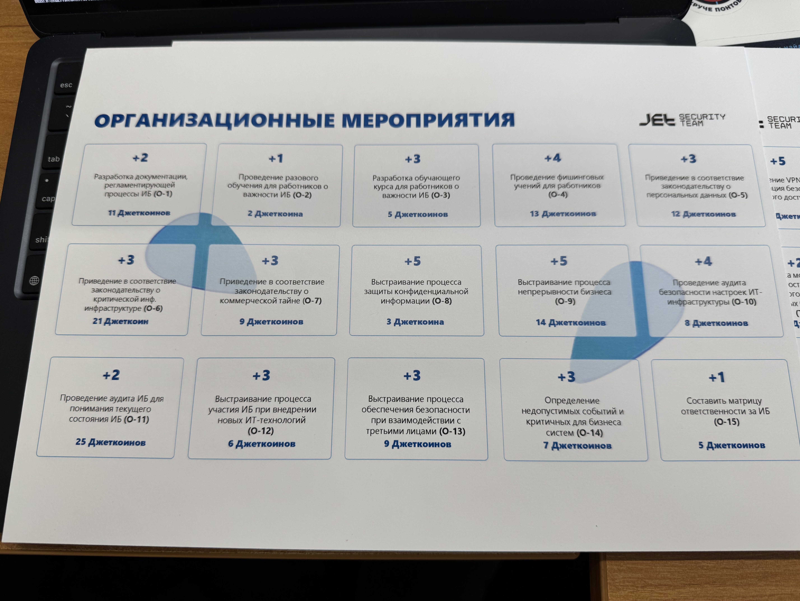
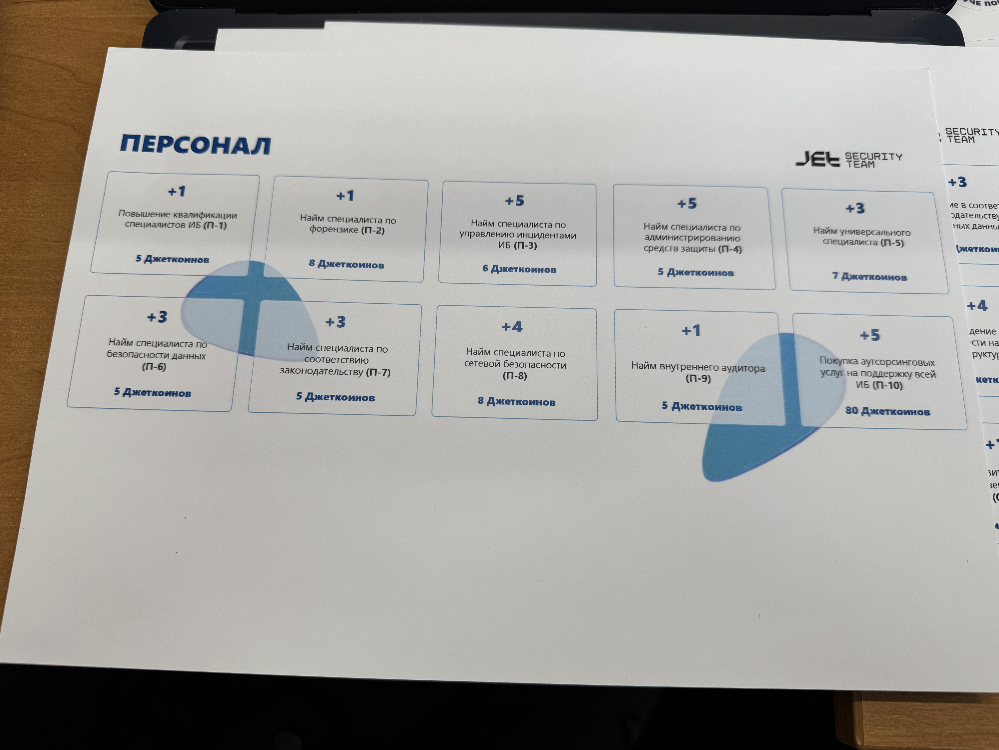
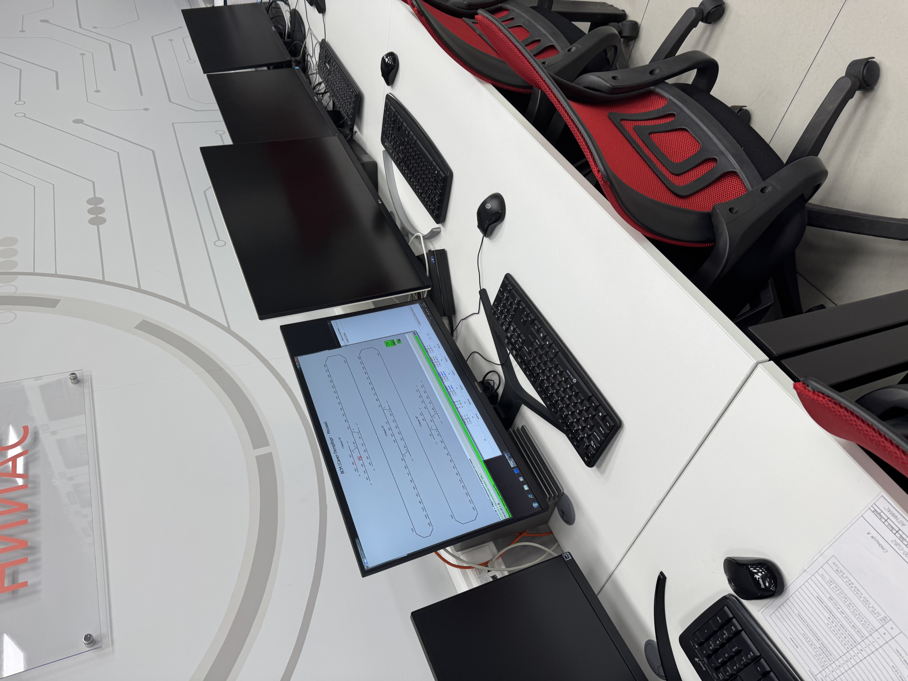

# Взаимодействие с организацией-партнером (отчеты)
**Срок окончания работы над задачей:** 23 и 24 апреля 2025 года.

## Мастер-класс: _"Инфосистемы Джет, "Выключите SOC, мы теряем деньги!"_

**Дата:** 23 апреля 2025 года.
**Время:** 16:00.

### Отчет

**Фото с мастер-класса:**

___

Мастер-класс был организован в формате деловой игры, где участникам предстояло примерить на себя роль CISO (Chief 
Information Security Officer) в условной компании. Согласно легенде, участник только что занял должность, и уже через 
сутки от него требуется предоставить план развития информационной безопасности (ИБ) на год вперёд. Условия были 
максимально приближены к реальности: жёсткие временные рамки, ограниченный бюджет и необходимость быстрого принятия 
приоритетных решений в сфере ИБ.

#### Полученные знания и опыт

В процессе мастер-класса были проработаны следующие аспекты:
•	**Оценка текущего уровня зрелости ИБ:** обучение принципам оценки защищённости инфраструктуры компании и выявлению 
ключевых рисков.
•	**Приоритизация мер по ИБ:** как на ограниченном бюджете выбрать наиболее критичные мероприятия (например, внедрение 
двухфакторной аутентификации, аудит уязвимостей, повышение осведомлённости сотрудников).
•	**Реальное применение фреймворков:** использование моделей, таких как NIST, MITRE ATT&CK и других для обоснования выбора
мер защиты.
•	**Коммуникация с руководством:** как грамотно аргументировать инвестиции в ИБ с точки зрения бизнес-приоритетов.

Особое внимание уделялось тому, что не все меры одинаково эффективны и “много SOC — не всегда хорошо”. 
Участникам нужно было доказать эффективность предложенных инициатив, исходя из конкретной бизнес-ситуации.

#### Связь с моей специальностью

Специальность **«Информационная безопасность автоматизированных систем»** напрямую связана с тематикой мастер-класса. 
Особенно полезным стал практический опыт оценки защищённости корпоративной инфраструктуры и выбор приоритетных 
направлений защиты автоматизированных систем. Такие навыки критически важны при проектировании и защите реальных 
ИТ-систем, в том числе в условиях ограниченных ресурсов — что является частым сценарием в реальной практике.

#### Связь с моим проектом

Мой текущий проект — **«Инфографика для популяризации свободного ПО»** — направлен на повышение осведомлённости 
пользователей и специалистов о возможностях и преимуществах свободного программного обеспечения (СПО). Полученные 
знания с мастер-класса могут быть использованы в проекте следующим образом:
•	**Освещение вопросов безопасности при использовании СПО** — демонстрация через инфографику, что правильно настроенное 
СПО может обеспечить высокий уровень безопасности при минимальных затратах.
•	**Примеры оптимизации бюджета на ИБ с помощью СПО** — отражение в инфографике идей, как организации могут снизить 
расходы на ИБ за счёт использования open-source решений (например, SIEM, IDS/IPS, утилиты для аудита и мониторинга).
•	**Популяризация подхода к приоритизации ИБ-мер** — включение в инфографику схем и диаграмм, иллюстрирующих правильный 
подход к выбору защитных мероприятий на основе анализа рисков.

#### Заключение

Мастер-класс дал ценный опыт в принятии управленческих решений в области ИБ в условиях ограниченных ресурсов. Полученные
знания дополнили мои профессиональные компетенции как специалиста в области ИБ автоматизированных систем и могут быть 
успешно интегрированы в мой проект по популяризации СПО.

## Экскурсия в АО "НИИАС"

**Дата:** 24 апреля 2025 года.
**Время:** 14:00.

### Отчет
**Фото с экскурсии:**

___

АО «НИИАС» — это ключевой исследовательский центр в составе холдинга РЖД, который занимается разработками в области 
интеллектуальных систем управления железнодорожным транспортом. Цель экскурсии — познакомить студентов с современными 
технологиями обеспечения безопасности движения поездов, мониторинга и цифровизации управления железнодорожной 
инфраструктурой.

В рамках экскурсии были посещены два ключевых испытательных полигона:
1.	**Системы контроля машинистов и торможения:**
Здесь демонстрировались разработки, направленные на анализ состояния машиниста (например, биометрические сенсоры, 
системы контроля внимания) и автоматическое регулирование тормозных систем поездов. Особый акцент был сделан на 
взаимодействии человек-машина и критически важной роли ИБ в таких системах.
2.	**Лаборатория маршрутизации и оконных процессов:**
Участники увидели, как тестируются программные и аппаратные решения для маршрутизации поездов и управления движением 
на уровне всей сети. Это включает в себя цифровое моделирование сценариев, проверку алгоритмов и защиту от сбоев и 
киберугроз.

#### Полученные знания и опыт

В ходе экскурсии я получил представление о:
•	**Реальном применении ИБ в критически важных АСУ** — особенно в системах, где ошибка может стоить жизней.
•	**Интеграции ИБ в процесс проектирования** — не как надстройки, а как встроенного элемента в архитектуру систем 
мониторинга и управления.
•	**Использовании цифровых двойников и стендов** для проверки устойчивости систем к внешним воздействиям, в том числе 
возможным кибератакам.
•	**Значении стандартизации и сертификации** — особенно в контексте критической ИТ-инфраструктуры (например, транспортной 
отрасли).

#### Связь с моей специальностью

Моя специальность — **«Информационная безопасность автоматизированных систем»** — тесно связана с тематикой экскурсии. 
Разрабатываемые в НИИАС интеллектуальные системы управления движением поездов представляют собой сложные 
автоматизированные комплексы, где устойчивость к сбоям и защита от внешних воздействий являются приоритетами.

Посещение лабораторий позволило на практике увидеть, как ИБ реализуется в железнодорожной отрасли и какие методы 
используются для минимизации рисков и человеческого фактора.

#### Связь с моим проектом

Мой проект — **«Инфографика для популяризации свободного ПО»** — нацелен на визуализацию преимуществ и возможностей 
свободных решений. После экскурсии я вижу потенциал расширения проекта следующими темами:
•	**Показ примеров применения СПО в критически важных системах** — например, систем мониторинга на основе Linux, 
open-source SCADA решений и систем логирования.
•	**Инфографика по безопасности свободного ПО в критических инфраструктурах** — развенчание мифов и подчёркивание 
преимуществ открытого кода в плане прозрачности и контроля.
•	**Демонстрация тестовых процессов через визуальные схемы** — отображение этапов валидации и сертификации решений, 
в том числе построенных на базе СПО.

#### Заключение

Экскурсия в АО «НИИАС» стала отличной возможностью ознакомиться с передовыми технологиями в сфере интеллектуального 
транспорта и их ролью в обеспечении безопасности. Полученные знания укрепили понимание того, как ИБ реализуется на 
практике в масштабных автоматизированных системах. Это напрямую связано с моей профессиональной специализацией и 
вдохновляет на дальнейшее развитие моего проекта по популяризации свободного ПО через инфографику.
